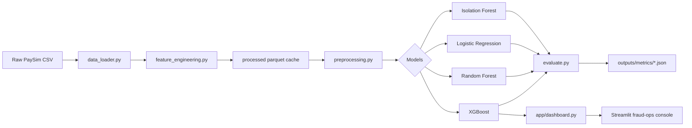

# Real-Time Fraud Detection on Mobile Money Transactions

This project scores PaySim mobile-money transactions for fraud risk using a small set of supervised and unsupervised models, feature engineering based on balance inconsistencies, and a Streamlit fraud-ops dashboard. The repo is a portfolio-grade implementation, not a production fraud platform.

## Business Problem

Mobile money systems process large volumes of low-value transactions. Fraud is rare, but when it happens the financial loss can be much larger than the cost of reviewing a transaction. The project therefore focuses on minimizing expected business cost, not maximizing raw accuracy.

The cost model used in evaluation is:

- False positive: $50
- False negative: $500

## Dataset

The project uses the Kaggle PaySim dataset: Synthetic Financial Datasets For Fraud Detection (`ealaxi/paysim1`).

### Real data used in this workspace

- Raw CSV size: 6,362,620 rows
- Fraud rows in raw data: 8,213
- Fraud rate in raw data: 0.1291%
- Sampled training dataset: 500,000 rows
- Fraud rows in sampled data: 645
- Rows after filtering `PAYMENT` and `CASH_IN`: 221,223
- Fraud rate after filtering: 0.2916%
- Time-aware split from the filtered sample:
  - Train: 159,834 rows
  - Validation: 28,206 rows
  - Test: 33,183 rows
  - Test fraud count: 312
  - Test fraud rate: 0.9402%

PaySim fraud in this project is only modeled for `TRANSFER`, `CASH_OUT`, and `DEBIT`. `PAYMENT` and `CASH_IN` are filtered out because the dataset contains zero fraud for those categories.

## How the Pipeline Works



The code prefers `data/processed/featured_transactions.parquet` when it exists, so the engineered dataset is reused instead of re-reading and re-engineering the raw CSV repeatedly.

## Feature Engineering

The engineered dataset keeps the original PaySim numeric fields and adds the following features:

- `errorBalanceOrig`
- `errorBalanceDest`
- `hasBalanceErrorOrig`
- `hasBalanceErrorDest`
- `amountToOldBalanceRatio`
- `drainsFullBalance`
- `logAmount`
- `isNewDestAccount`
- `isZeroOrigBalance`
- `balanceChangeOrig`
- `balanceChangeDest`
- one-hot encoded `type_*` columns for the remaining transaction types

Identifiers and non-model columns are excluded from the feature matrix:

- `nameOrig`
- `nameDest`
- `type`
- `isFraud`
- `isFlaggedFraud`

## Models

Implemented training paths:

- Logistic Regression baseline in `src/models/baseline.py`
- Random Forest in `src/models/tree_ensemble.py`
- XGBoost in `src/models/tree_ensemble.py`
- Isolation Forest in `src/models/anomaly_detection.py`
- AutoEncoder code exists in `src/models/anomaly_detection.py`, but it was not evaluated in this workspace because TensorFlow is not importable in the current Python 3.14 runtime

The tree-ensemble trainer now uses Optuna for XGBoost tuning with TPE sampling and cross-validated PR-AUC. Random Forest still uses `RandomizedSearchCV`.

## Evaluation

Primary metric: PR-AUC

Secondary metrics:

- Precision
- Recall
- F1
- ROC-AUC
- Cost at the chosen threshold

Threshold selection is cost-based. The code picks the threshold that minimizes expected cost under the false-positive / false-negative matrix above.

## Results

All values below come from the saved JSON artifacts in `outputs/metrics/` or from the comparison artifact generated in this workspace.

| Model | PR-AUC | Precision | Recall | F1 | Threshold | Total cost | CV PR-AUC |
|---|---:|---:|---:|---:|---:|---:|---:|
| Logistic Regression | 0.9856 | 0.9341 | 1.0000 | 0.9659 | 0.7041 | 1100 | 0.8772 ± 0.0307 |
| Random Forest | 1.0000 | 1.0000 | 1.0000 | 1.0000 | 0.4286 | 0 | N/A |
| XGBoost | 1.0000 | 1.0000 | 1.0000 | 1.0000 | 0.9838 | 0 | 0.9925 ± 0.0093 |
| Isolation Forest | 0.4031 | 0.2035 | 0.7372 | 0.3190 | 0.5642 | 86000 | N/A |

### Imbalance Strategy Comparison

The project includes class weighting, SMOTE, SMOTE-ENN, and undersampling. In this workspace run, XGBoost with class weighting was the best tradeoff because it matched the best PR-AUC while staying the fastest.

| Strategy | PR-AUC | Precision | Recall | F1 | Training time (s) | Threshold | Total cost |
|---|---:|---:|---:|---:|---:|---:|---:|
| class_weight | 1.0000 | 1.0000 | 1.0000 | 1.0000 | 1.11 | 0.9454 | 0 |
| smote | 1.0000 | 1.0000 | 1.0000 | 1.0000 | 4.68 | 0.5485 | 0 |
| undersample | 1.0000 | 0.9936 | 1.0000 | 0.9968 | 0.13 | 0.8480 | 100 |
| smote_enn | 0.9999 | 0.9873 | 1.0000 | 0.9936 | 51.77 | 0.4438 | 200 |

## Key Insights

1. Filtering `PAYMENT` and `CASH_IN` reduces noise because those transaction types have no fraud labels in PaySim.
2. Balance reconciliation features are the core signal. `hasBalanceErrorOrig`, `errorBalanceOrig`, `balanceChangeOrig`, and `drainsFullBalance` are the strongest engineered patterns.
3. The synthetic PaySim fraud mechanism produces very strong separation between fraud and non-fraud transactions. That is why Random Forest and XGBoost both reach near-perfect test metrics on this sample.
4. PR-AUC is more informative than accuracy for this class imbalance. A naive all-legit predictor would look good on accuracy and fail completely on fraud detection.
5. The cost-based threshold is essential. The default 0.5 cutoff is not the right operating point when missed fraud is much more expensive than a false decline.

## Dashboard

`app/dashboard.py` is a Streamlit fraud-ops console with three tabs:

- Live Scoring: score the held-out batch or an uploaded CSV, sort by fraud probability, and inspect the highest-risk rows
- Model Performance: show PR-AUC, ROC-AUC, precision, recall, F1, confusion matrix, and probability distribution charts
- Explainability: show a local SHAP explanation for a selected scored transaction plus the top global SHAP contributors

Controls live in the sidebar:

- model selector
- threshold slider
- false positive and false negative cost inputs
- CSV upload
- advanced SHAP sample sizing

The dashboard only uses data and models that the pipeline actually produces.

## Tests

The current pytest coverage includes:

- `tests/test_feature_engineering.py`
- `tests/test_preprocessing.py`
- `tests/test_evaluate.py`

The added evaluation tests check the cost-optimal threshold logic and the resulting confusion matrix for a known toy example.

Run the suite with:

```bash
pytest tests -q
```

## Setup

```bash
python -m venv .venv
.venv\Scripts\activate
python -m pip install -r requirements.txt
```

If the PaySim CSV is present in `data/raw/`, the pipeline will use it. If `data/processed/featured_transactions.parquet` already exists, the training scripts and dashboard will reuse it directly.

### Useful commands

```bash
python -m src.data_loader
python -m src.feature_engineering
python -m src.models.baseline
python -m src.models.tree_ensemble
python -m src.models.tree_ensemble --compare-imbalance
python -m src.models.anomaly_detection
streamlit run app/dashboard.py
pytest tests -q
```

## Screenshots

Add dashboard screenshots here after running `streamlit run app/dashboard.py`.

## Limitations

- PaySim is synthetic, so the near-perfect supervised metrics should not be treated as real production performance.
- The best-performing features in this dataset are strongly aligned with the fraud injection logic, which makes the task unusually separable.
- The AutoEncoder is implemented but was not evaluated in this workspace because TensorFlow is unavailable in the current Python 3.14 runtime.
- Reported metrics come from the 500,000-row stratified sample and the resulting 221,223-row filtered dataset, not from the full 6.3M rows.

## Future Work

- Train on the full 6.3M-row dataset
- Add real-time scoring from a streaming ingress path
- Add drift monitoring and alerting
- Add graph/network features for mule and shared-account detection
- Run champion/challenger comparisons with rollback logic

## License

Portfolio / educational use. PaySim dataset subject to Kaggle terms.